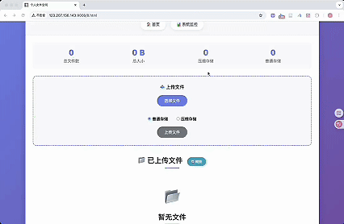

# 🚀 WebServer + Storage System + Server Monitor

一个**集成式高性能服务器解决方案**，包含 **Web Server**、**存储系统** 和 **服务器监控** 三大模块，适用于需要同时提供网络服务、数据存储与实时监控的场景。

---

## ✨ 功能特性

### **1️⃣ Web Server**
- **高性能并发模型**
  - 线程池 + 非阻塞 Socket
  - `epoll` (ET / LT 模式均支持)
  - Reactor / 模拟 Proactor 事件处理模式
- **HTTP 报文解析**
  - 基于状态机解析 **GET** / **POST** 请求
- **用户管理**
  - 基于 MySQL 数据库实现 Web 端注册 & 登录
- **静态资源访问**
  - 支持图片、视频等静态文件访问
- **日志系统**
  - 支持**同步** / **异步**日志记录
- **高并发性能**
  - Webbench 压测可达 **万级并发连接**
- **重复申请防护**
  - 基于 Redis Token 验证防止重复申请

---

### **2️⃣ Storage System**
- **文件上传 / 下载**
- **文件存储与读取**
- **已上传文件列表展示**
- **可选压缩 / 解压功能**
  - 基于 [`bundle`](https://github.com/r-lyeh-archived/bundle) 库

---

### **3️⃣ Server Monitor**
- 实时监控：
  - CPU / 内存 / 硬盘 / 网络使用率
  - 当前连接的客户端数量
- 数据可视化仪表盘展示运行状态

---

## 📂 项目结构
```bash
project-root/
├── CGImysql/      # 数据库连接池
├── Server_log/    # 日志文件存储
├── Storage/       # 文件存储模块
├── Util/          # 工具类
├── http/          # HTTP 协议实现
├── lock/          # 互斥锁与信号量
├── log/           # 日志模块
├── metrics/       # 服务器监控模块
├── root/          # 静态资源目录
├── threadpool/    # 线程池
├── timer/         # 定时器
└── README.md
```
---
## 🛠 技术栈
+ 网络：C++ 多线程 + 非阻塞 IO + epoll
+ 数据库：MySQL
+ 监控：Linux Socket / 系统调用
+ 日志：同步/异步日志系统

# 🎬 Demo 演示

## 📋 功能演示

### 用户认证系统

*用户注册、登录、权限验证等完整认证流程*

### 文件管理系统  

*支持文件上传、下载、预览、批量操作等功能*

### 服务器监控面板

*实时监控服务器性能指标、资源使用情况及系统状态*

---

## ⚡ 快速运行
### 1.安装依赖
#### jsoncpp
```bash
sudo apt-get libjsoncpp-dev
其头文件所在路径是：/usr/include/jsoncpp/json
动态库在：/usr/lib/x86_64-linux-gnu/libjsoncpp.so-版本号
编译时需要根据动态库的路径进行正确的设置，否则很容易出现“undefined reference to”问题。
使用g++编译时直接加上“-ljsoncpp”选项即可。
```
#### bundle
源码链接：https://github.com/r-lyeh-archived/bundle

克隆下来包含bundle.cpp与bundle.h即可使用

#### cpp-base64
git clone https://github.com/ReneNyffenegger/cpp-base64.git 

### 2.数据库初始化
```bash
// 建立yourdb库
create database yourdb;

// 创建user表
USE yourdb;
CREATE TABLE user(
    username char(50) NULL,
    passwd char(50) NULL
)ENGINE=InnoDB;

// 添加数据
INSERT INTO user(username, passwd) VALUES('name', 'passwd');
```

### 3.修改配置
#### main.cpp
```bash
//数据库登录名,密码,库名
string user = "root";
string passwd = "root";
string databasename = "yourdb";
```
#### Storage.conf
```bash
{
    "server_port" : your_port,
    "server_ip" : "your_ip", 
    "download_prefix" : "/download/", 
    "deep_storage_dir" : "./deep_storage/",   
    "low_storage_dir" : "./low_storage/", 
    "bundle_format":4,
    "storage_info" : "./storage.data"
}
```
### 4. 编译与启动
```bash
sh ./build.sh
./server
```

### 8. 浏览器访问
```bash
<your_ip>:9006
```
